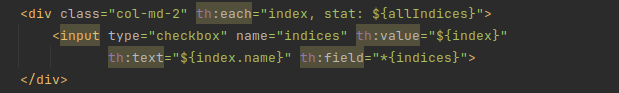
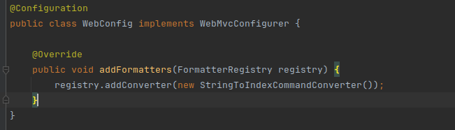

# spring-boot-demo
If check box is bound to a custom Object. You must implement a spring custom type converter.

In the New Company Form, the following Multiple Checkboxes are bound to the property indices of Command Object CompanyCommand

### Without a custom type converter. The following error occurs when trying to submit the form:

#### Resolved [org.springframework.validation.BindException: org.springframework.validation.BeanPropertyBindingResult: 1 errors<EOL>Field error in object 'company' on field 'indices': rejected value [IndexCommand(id=1, name=S&P500),IndexCommand(id=4, name=DJIA)]; codes [typeMismatch.company.indices,typeMismatch.indices,typeMismatch.[Lmojo.springframework.demo.commands.IndexCommand;,typeMismatch]; arguments [org.springframework.context.support.DefaultMessageSourceResolvable: codes [company.indices,indices]; arguments []; default message [indices]]; default message [Failed to convert property value of type 'java.lang.String[]' to required type 'mojo.springframework.demo.commands.IndexCommand[]' for property 'indices'; nested exception is java.lang.IllegalStateException: Cannot convert value of type 'java.lang.String' to required type 'mojo.springframework.demo.commands.IndexCommand' for property 'indices[0]': no matching editors or conversion strategy found]]

### The Important Part is:
#### Failed to convert property value of type 'java.lang.String[]' to required type 'mojo.springframework.demo.commands.IndexCommand[]

To solve this issue, we add the following Converter class:
#### mojo.springframework.demo.converters.StringToIndexCommandConverter

And add the Converter to the FormatterRegistry in a Configuration Class (mojo.springframework.demo.configuration.WebConfig),
as follows:

